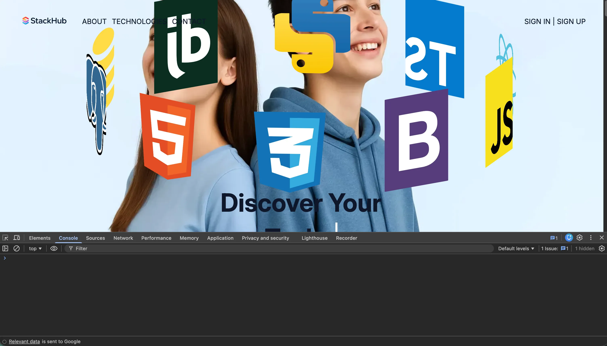
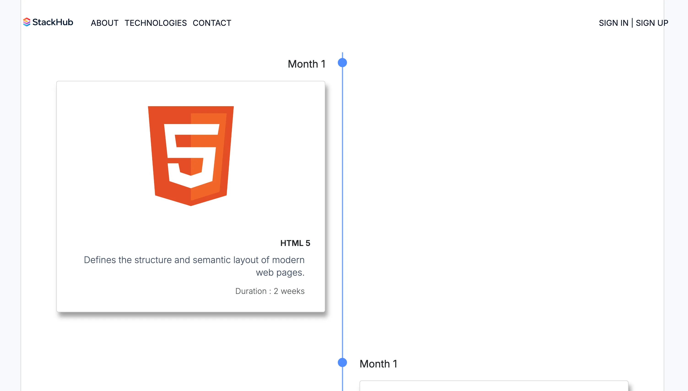
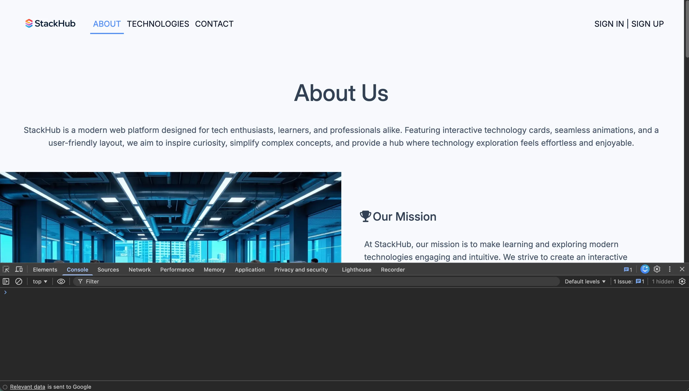
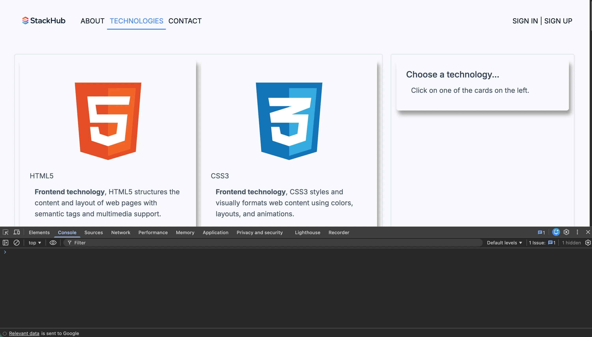
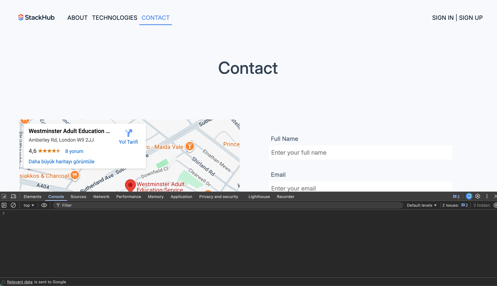
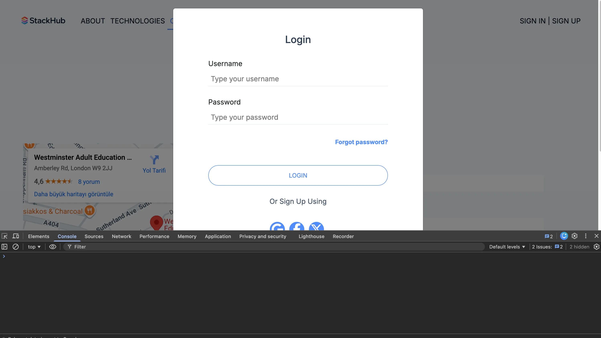
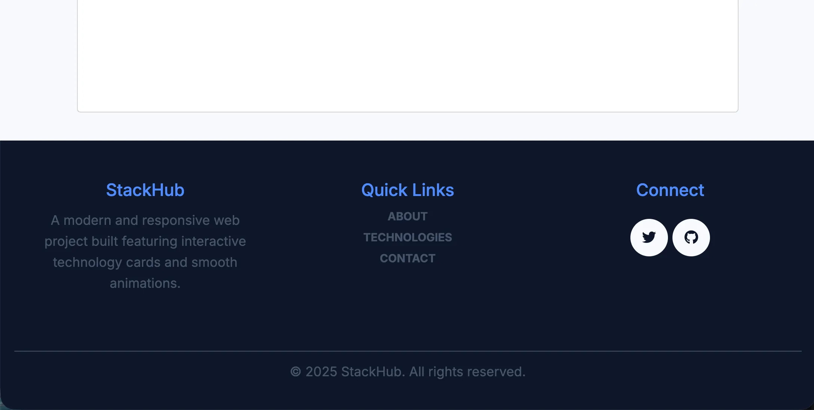
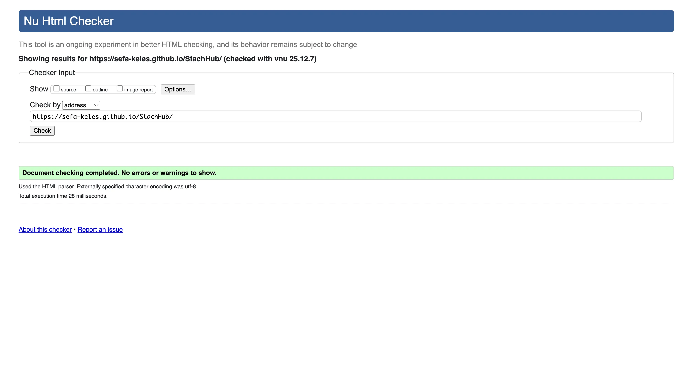
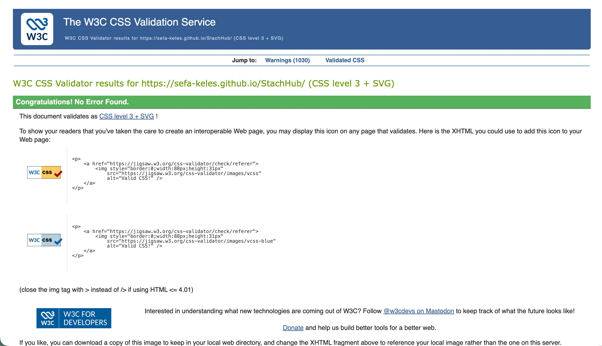
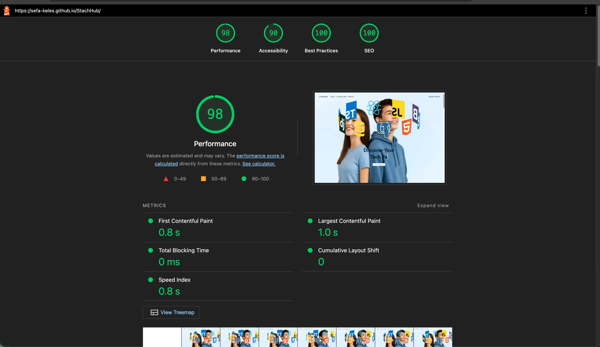

# StackHub

[Explore the Live Version of StackHub](https://sefa-keles.github.io/StachHub/)

StackHub is an interactive, responsive web project built with HTML, CSS, Bootstrap, and JavaScript. It showcases frontend, backend, and fullstack technologies through dynamic 3D animated cards, timelines, and detailed technology insights. The website features a modern hero section with a typewriter-animated call-to-action button, interactive technology timelines, a detailed About Us section, a Technology detail page, and a fully functional Contact form, along with a Sign In / Sign Up modal and a consistent footer across all pages.

## Table of Contents

- [Updates](#updates)
- [Project Goals](#project-goals)
- [Responsive Design](#responsive-design)
- [Bootstrap's Responsive Grid System](#bootstraps-responsive-grid-system)
- [Custom Media Queries](#custom-media-queries)
- [Flexible Images and Layouts](#flexible-images-and-layouts)
- [Target Audience](#target-audience)
- [User Goals](#user-goals)
- [User Experience (UX)](#user-experience-ux)
- [User Stories & Acceptance Criteria](#user-stories--acceptance-criteria)
- [Design Justification](#design-justification)
- [Homepage](#homepage)
- [Article Page](#article-page)
- [Additional Pages](#additional-pages)
- [Technologies](#technologies)
- [Sources](#sources)
- [Timeline seasons](#timeline-seasons)
- [Limitations](#limitations)
- [Content](#content)

## Updates

- **Technologies Page Redesign:** Originally designed for desktop, the `Technologies.html` page was later re-styled using CSS Grid with a **mobile-first approach**, ensuring optimal layout and usability across all devices.  

- **Sticky Technology Details Card:** The Technology Details card on `Technologies.html` is now **sticky**, remaining visible while scrolling. This allows users to reference detailed information without losing context as they navigate through the tech cards.  

- **JavaScript Enhancements:** Although the project could function without JavaScript, the following features were implemented for improved interactivity and user experience:
  - **Flip animations** for the frontend, backend, and fullstack timeline cards on the homepage.
  - **Typewriter animation** for the hero section call-to-action button.
  - Dynamic content injection into the Technology Details card from an external JavaScript file.  

- **Image Optimization:** All images were converted to **WebP format** for better compression and faster load times, without compromising visual quality.  

- **Responsive Design Enhancements:** The site leverages **Bootstrap, Flexbox, and pure CSS techniques** to showcase proficiency in responsive layouts and modern frontend practices.  

- **AI-Generated Visuals:** A custom **logo** and a **hero background image** were generated using AI to create a unique branding and visual identity.  

- **UI/UX Improvements:**
  - Added **hover effects and smooth transitions** to buttons for a more interactive feel.
  - Flip animations for timeline cards were **softened with smooth transitions** for better visual appeal.

These updates reflect a combination of modern frontend practices, performance optimization, and enhanced interactivity to provide a polished user experience.

## Project Goals

The main objective of **StackHub** is to create an **interactive, educational, and visually engaging platform** for users to explore and learn about frontend, backend, and fullstack technologies in a structured and intuitive way.  

Key goals of the project include:

- **Showcase Technology Learning Paths:** Present frontend, backend, and fullstack technologies in a timeline-based structure, allowing users to understand the progression of learning each technology over time.  

- **Enhance User Interaction:** Utilize animations, 3D card flips, and typewriter effects to make the learning experience dynamic and engaging, demonstrating practical use of **JavaScript, CSS, and Bootstrap**.  

- **Responsive and Accessible Design:** Ensure the platform is fully responsive across devices using **mobile-first CSS Grid, Flexbox, and Bootstrap**, providing a seamless user experience on desktops, tablets, and mobile devices.  

- **Sticky Content for Continuous Reference:** Keep key information visible with **sticky Technology Details cards**, allowing users to refer to detailed tech content while navigating the page.  

- **Optimize Performance:** Convert all images to **WebP format**, implement efficient layout techniques, and apply smooth transitions and hover effects to enhance visual performance without sacrificing load times.  

- **Demonstrate Modern Frontend Practices:** Combine multiple frontend techniques—including **Bootstrap, custom CSS, Flexbox, CSS Grid, and minimal JavaScript enhancements**—to create a polished, maintainable, and professional-quality project.  

- **Unique Branding and Visual Identity:** Use **AI-generated visuals** for the logo and hero background to provide a unique and modern aesthetic that reinforces the platform’s identity.  

- **Prepare for Future Scalability:** Structure the project in a modular and organized way, allowing easy addition of new technologies, features, or learning modules in the future.  

**StackHub** aims to be not just a showcase of coding skills, but a **user-focused educational tool** that combines functionality, interactivity, and aesthetics to provide an optimal learning experience.

## Responsive Design

The StackHub project was developed with a strong **mobile-first approach**, ensuring that the website provides an optimal experience across all devices. While the project primarily relies on HTML, CSS, and Bootstrap, additional techniques including Flexbox, CSS Grid, and JavaScript enhancements were used to deliver interactive and visually engaging components.

### Hero Section 3D Cards
The hero section contains animated 3D cards showcasing different technologies. On mobile devices, these cards display correctly in a single row and maintain their perspective. As the screen size increases, the cards grow in size and their `translateZ` and perspective values are dynamically adjusted in pixels to enhance the 3D animation, providing a richer visual experience on larger screens.

### Timeline Cards (Frontend / Backend / Fullstack)
The timeline cards are fully responsive:
- **Mobile:** Cards are displayed in a single column, stacked vertically.
- **Tablet and above:** The timeline layout expands to a full view with alternating left and right positioning of cards. A central line separates the two sides, achieving a traditional timeline appearance.
- **Animations:** Flip animations are preserved across devices, with smooth transitions for both horizontal and vertical flips.

### Technologies Page (Tech Wrapper & Tech Detail)
The Technologies.html page is designed using CSS Grid with a **mobile-first layout**:
- **Mobile:** The Tech Detail card appears at the top, followed by the Tech Wrapper section with all technology cards displayed in a single column.
- **Laptop / Desktop (≥992px):** The page splits into two columns: Tech Wrapper on the left with cards stacked in a single column, and Tech Detail on the right.
- **Large Desktop:** The layout expands to three columns: Tech Wrapper occupies two columns (cards arranged in two vertical columns), and Tech Detail occupies the third column, remaining sticky so that detailed information stays visible while scrolling.

### Implementation Notes
- **Bootstrap Classes & Media Queries:** Mobile-first design is reinforced using Bootstrap’s prebuilt classes and custom media queries for fine-tuned responsiveness at breakpoints.
- **JavaScript Enhancements:** Although not required, JavaScript is used for the hero section typewriter animation, card flip animations, and dynamically populating Tech Detail information.
- **Performance & Optimization:** All images are converted to WebP format to reduce loading times without compromising quality.
- **Smooth Interactions:** Button hover effects, card flip transitions, and other animations include easing and transition effects for a polished user experience.

This responsive strategy ensures that StackHub delivers a visually engaging, fully functional experience from mobile devices to large desktops while maintaining accessibility, usability, and aesthetic consistency.

## Bootstrap's Responsive Grid System

StackHub leverages **Bootstrap’s responsive grid system** to structure content efficiently across different devices. While mobile-first design guides the layout, Bootstrap provides a flexible, mobile-first foundation to handle multiple breakpoints with ease.

### Key Implementations

1. **Hero Section Cards**
   - The 3D animated technology cards are placed within Bootstrap grid columns, ensuring they scale correctly across different screen sizes.
   - On mobile, cards occupy a single row for optimal viewing.
   - On larger screens, column widths and spacing are adjusted dynamically to preserve the 3D perspective and animation effects.

2. **Timeline Cards**
   - Timeline sections (Frontend, Backend, Fullstack) are structured using Bootstrap rows and columns.
   - Mobile devices display cards in a single vertical column.
   - Tablets and desktops use alternating columns (left and right) for a visually engaging timeline, with a central line dividing the layout.

3. **Technologies Page (Tech Wrapper & Tech Detail)**
   - **Mobile-first:** Each card occupies a full-width column.
   - **Laptop / Desktop:** Grid layout divides the page into multiple columns:
     - Two columns for Tech Wrapper cards.
     - One column for the sticky Tech Detail card.
   - Grid adjustments maintain readability and usability while ensuring Tech Detail remains visible as the user scrolls.

4. **Other Sections**
   - The About page gallery, team profiles, and other card-based layouts also use Bootstrap columns combined with Flexbox utilities for alignment and spacing.
   - Responsive margins, paddings, and row configurations are fine-tuned for each breakpoint to maintain aesthetic consistency.

### Best Practices
- Combined **Bootstrap classes** with **custom media queries** where necessary to achieve exact control over layouts.
- Used semantic HTML and grid containers for maintainability and accessibility.
- Applied Bootstrap’s **mobile-first philosophy**, ensuring that layouts start with a clean, optimized mobile experience and progressively enhance for larger screens.

By combining Bootstrap’s responsive grid system with custom CSS and mobile-first thinking, StackHub achieves a **fluid, consistent, and visually appealing layout** on every device.

## Custom Media Queries

While Bootstrap provides a solid foundation for responsive design, StackHub uses **custom CSS media queries** to fine-tune layouts and animations for specific screen sizes. These adjustments ensure that elements like 3D hero cards, timelines, and Tech Detail cards behave optimally across all devices.

### Key Implementations

1. **Hero Section 3D Cards**
   - Mobile-first design ensures that cards display correctly on small screens.
   - As screen width increases, media queries adjust card sizes, `perspective`, and `translateZ` values to maintain the visual impact of the 3D rotation.
   - This dynamic scaling provides a smooth, immersive 3D animation effect on larger screens.

2. **Timeline Section**
   - Mobile screens display timeline cards in a single vertical column for clarity.
   - Tablets and desktops use custom media queries to switch to a full timeline layout:
     - Cards alternate between left and right sides of a central line.
     - Ensures readability while maintaining a visually engaging design.
   - Fine-tuned margins, padding, and alignment ensure consistency across breakpoints.

3. **Technologies Page**
   - **Mobile View:** Tech Detail card appears first, followed by Tech Wrapper cards in a single column.
   - **Laptop / Desktop View:** Media queries divide the page into two or three columns:
     - Two columns for Tech Wrapper cards (stacked in two vertical columns on larger screens).
     - One column for Tech Detail card, which remains sticky and visible while scrolling.
   - Custom breakpoints ensure that card sizes, spacing, and grid proportions remain balanced at each viewport width.

4. **Other Enhancements**
   - Applied custom queries for button hover effects, card flip transitions, and spacing adjustments.
   - Ensures that all interactive elements maintain smooth animations and usability across devices.
   - Overrides or complements Bootstrap breakpoints where specific design precision is required.

### Best Practices
- Combine **mobile-first approach** with precise breakpoints for tablets and desktops.
- Use media queries to handle edge cases where Bootstrap classes alone do not provide full control.
- Maintain readability, usability, and animation consistency across all screen sizes.

With custom media queries, StackHub ensures a **polished, responsive experience** while maximizing the impact of visual elements and interactive features.

## Flexible Images and Layouts

StackHub emphasizes a **fluid and adaptive layout** that maintains visual integrity across all devices. Images, cards, and content sections are designed to scale naturally, providing a seamless user experience on mobile, tablet, and desktop screens.

### Key Implementations

1. **Hero Section Images**
   - Technology logos and hero background are optimized as **WebP** for faster loading and better compression.
   - 3D perspective cards dynamically scale based on screen width, ensuring images maintain clarity while the animation grows in size.
   - Images maintain aspect ratios across different viewports, preventing distortion during scaling.

2. **Timeline Cards**
   - Frontend, Backend, and Fullstack timelines are built with responsive cards.
   - Mobile screens display a single vertical column of cards.
   - Larger screens arrange timeline cards on alternating sides of a central line, providing a visually appealing, **dual-column timeline layout**.
   - Card images, icons, and duration labels remain legible and proportionate at all breakpoints.

3. **Technologies Page**
   - Tech Wrapper cards are flexible within CSS Grid layouts:
     - **Mobile-first:** Single column stacking.
     - **Tablet and Desktop:** Two columns for Tech Wrapper and sticky Tech Detail card on the side.
   - Images inside tech cards adapt to container width without overflowing or losing resolution.
   - Buttons and icons within cards resize proportionally to ensure a consistent UI.

4. **About Us Page**
   - Company images in the gallery use **flexbox** and CSS Grid to create responsive arrangements.
   - Team section uses three equal-width columns that collapse gracefully on smaller screens.
   - All images maintain quality while fitting seamlessly into layout structures.

5. **Footer**
   - Footer icons and social media buttons scale proportionally with screen size.
   - Maintains alignment and spacing across devices, preventing crowding or overlap.

### Best Practices
- Use **WebP format** for faster load times without sacrificing quality.
- Apply responsive units (`%, vw, vh`) for images and layout elements.
- Combine **Bootstrap classes**, flexbox, and pure CSS for precise control over spacing, alignment, and scaling.
- Test layouts on multiple devices to ensure that images, cards, and content remain clear, readable, and visually balanced.

By prioritizing flexible images and layouts, StackHub delivers a **consistent and visually engaging experience** across all devices, enhancing both usability and aesthetic appeal.

## Target Audience

StackHub is designed to cater to a wide range of users interested in learning and advancing their skills in web development. The project specifically targets the following audience segments:

1. **Aspiring Web Developers**
   - Individuals who are starting their journey in web development and want a clear, structured overview of frontend, backend, and fullstack technologies.
   - Users looking for a visual and interactive way to explore programming languages, frameworks, and development tools.

2. **Students and Bootcamp Participants**
   - Learners enrolled in coding bootcamps or computer science courses who benefit from a **timeline-based learning path** and technology-specific details.
   - Users who want quick access to key curriculum information, lesson durations, and example projects.

3. **Professional Developers Exploring New Technologies**
   - Developers seeking to expand their skill set in fullstack development.
   - Users who want to compare frontend and backend tools side by side and explore detailed technology content efficiently.

4. **Tech Enthusiasts**
   - Individuals with a general interest in modern web technologies, animations, and responsive design principles.
   - Users curious about interactive UI elements, such as 3D animated cards, flip timelines, and typewriter effects.

5. **UI/UX and Design Learners**
   - Users interested in seeing practical implementations of **mobile-first design, responsive layouts, and flexible image usage**.
   - Learners who want examples of combining **Bootstrap, CSS Grid, Flexbox, and JavaScript animations** in a coherent project.

### Key Takeaways
- StackHub aims to provide a **visually engaging and educational experience** for all users.
- The responsive design ensures that both novice and advanced users can access the content on **any device**, from smartphones to desktops.
- The interactive timeline, hero section, and technology detail cards are tailored to improve **user engagement, learning efficiency, and overall usability**.

By understanding and targeting these user groups, StackHub ensures that the platform is not only informative but also **intuitive, interactive, and relevant** to its audience.

## User Goals

StackHub is designed with clear objectives to meet the needs of its target users. Based on project planning, user stories, and competitor research, the following goals have been identified:

1. **Understand Web Development Concepts Clearly**
   - Users want to access a structured overview of **frontend, backend, and fullstack technologies**.
   - Goals are supported by **timeline cards** that show month-by-month learning paths, technology logos, short descriptions, and duration for each technology.

2. **Engage with Interactive Learning Tools**
   - Users seek a **visually appealing and interactive experience**, including:
     - Hero section with **3D rotating technology cards**.
     - Flip animations for tech stack timelines.
     - Typewriter-effect call-to-action buttons.
   - These features enhance engagement and make learning dynamic and memorable.

3. **Access Detailed Technology Information**
   - Users want **in-depth information** about each technology, including:
     - Detailed descriptions in the **Tech Detail card**.
     - Curriculums and lesson video references.
     - Ability to explore **frontend, backend, and fullstack technologies** interactively.

4. **Navigate Effortlessly Across Pages**
   - Users expect **intuitive navigation** between Index, About, Technologies, and Contact pages.
   - Sign Up / Sign In modal provides easy access for returning and new users.
   - All pages are **responsive**, ensuring accessibility on mobile, tablet, and desktop devices.

5. **Learn at Their Own Pace**
   - Timeline cards and structured content allow users to **track learning progress**.
   - Users can prioritize learning based on their interests and goals (frontend → backend → fullstack).

6. **Compare and Explore Competitor Features**
   - StackHub incorporates elements inspired by **Codecademy, freeCodeCamp, and roadmap.sh**, but focuses on:
     - Visual timelines.
     - Interactive 3D and flip animations.
     - Mobile-first responsive design with clear UI/UX principles.

### Key Takeaways
- StackHub enables users to **explore, learn, and practice** modern web development technologies.
- The design encourages **continuous engagement** with both content and interactive features.
- Users can **efficiently plan their learning path**, track their progress, and access detailed resources in a single platform.

## User Experience (UX)

The UX design of StackHub focuses on creating a seamless, engaging, and educational environment for users exploring web development technologies. Key UX considerations include:

### 1. **Intuitive Navigation**
- A **navbar** with logo, menu items (About, Technologies, Contact), and a Sign Up/Sign In button ensures users can quickly find relevant sections.
- Pages are structured for **easy access**, guiding users through hero sections, timelines, and detailed technology cards without confusion.

### 2. **Responsive Design & Mobile-First Approach**
- StackHub is **mobile-first**, ensuring all interactive elements and content are fully functional on smartphones, tablets, and desktops.
- Hero section 3D cards and timeline cards **scale and adapt** to screen size.
- Tech Detail cards remain **sticky on larger screens**, allowing users to view technology details while scrolling through tech cards.

### 3. **Interactive and Engaging Features**
- **3D rotating technology cards** in the hero section provide visual stimulation and highlight the learning focus areas.
- **Flip animations** for the tech stack timeline cards make content dynamic while clearly differentiating between frontend, backend, and fullstack.
- **Typewriter-effect buttons** guide users toward actionable next steps, increasing engagement.

### 4. **Visual Hierarchy and Content Clarity**
- Cards display month, technology logo, short description, and duration, making information **easy to scan** and digest.
- The layout prioritizes important content at the top (hero section) while supporting detailed exploration below (timeline cards and Tech Detail section).

### 5. **Consistency and Accessibility**
- Uniform **color palette, card styles, and typography** create a cohesive visual experience.
- Hover effects, smooth transitions, and responsive grids enhance interaction without overwhelming the user.
- Accessibility principles are considered for legibility and intuitive navigation, ensuring all users can interact with the platform effectively.

### 6. **Engagement and Motivation**
- Interactive timelines and sticky Tech Detail cards **encourage exploration** of different technologies.
- Users receive **visual feedback** via animations and hover effects, reinforcing learning and discovery.
- The combination of interactive elements, clear progression, and visually appealing cards fosters a sense of **achievement and motivation**.

### 7. **Footer and Persistent Links**
- The footer provides persistent access to **company info, navigation links, and social media**, ensuring users can easily move between pages or engage with external resources.

**Key Takeaway:**  
StackHub’s UX is designed to **empower users to learn, explore, and interact** with web development technologies efficiently, while keeping the experience visually engaging and responsive across all devices.

# Project Planning – StackHub

This section outlines the detailed project planning, including user stories, acceptance criteria, tasks, prioritization, and timeline for the development of **StackHub**.

---

## User Stories & Acceptance Criteria

### User Story 1 — Technology Timeline Card
**As a beginner web developer, I want to view the Frontend, Backend, and Fullstack technology timelines so that I can understand the correct learning path and choose where to start.**

**Acceptance Criteria**
- A large technology timeline card appears on the homepage.
- Front side displays the Frontend timeline list.
- Clicking “Backend Tech Stack” flips the card to show the backend timeline.
- Clicking “Fullstack Tech Stack” rotates the card vertically to show the fullstack timeline.
- All timelines are ordered chronologically or by recommended learning path.
- Fully responsive across all device sizes.

**Tasks**
1. Create a dedicated timeline section in HTML for the homepage.
2. Build a Bootstrap card structure with three flip views.
3. Implement CSS rotateY and rotateX animations.
4. Add Frontend timeline content to the front face.
5. Add Backend timeline content to the back face.
6. Add Fullstack content to the top/vertical flip.
7. Add JavaScript event listeners to the buttons for flipping.
8. Ensure responsiveness using Bootstrap grid and media queries.

---

### User Story 2 — Navbar & Page Navigation
**As a visitor, I want to navigate easily between Home, About, Technologies, and Contact pages so that I can quickly find the information I’m looking for.**

**Acceptance Criteria**
- Navbar includes a logo on the left, menu links in the center, and Signin/Signup on the right.
- Navbar appears consistently across all pages.
- Navbar becomes a hamburger menu on mobile devices.
- Signin/Signup buttons trigger popup modals.

**Tasks**
1. Build the navbar HTML structure.
2. Configure Bootstrap’s navbar and mobile collapse.
3. Add Signin/Signup modal triggers.
4. Link all pages to the same navbar layout.

---

### User Story 3 — Technologies Page
**As a learner, I want to click on a technology card and see its detailed description so that I can learn what it does and why I should use it.**

**Acceptance Criteria**
- Page layout must include two columns (Tech Wrapper and Tech Detail).
- Left column displays technology cards.
- Clicking a technology card updates the right column with details.
- Default state of the right column displays a placeholder message (e.g., “Select a technology”).
- Tech Detail card is sticky for visibility during scroll.

**Tasks**
1. Create a two-column layout using Bootstrap grid.
2. Add technology cards to the left panel.
3. Add a dynamic detail card to the right panel.
4. Implement JavaScript to load correct technology details when clicked.
5. Ensure responsive design for mobile-first view.

---

### User Story 4 — Contact Page
**As a visitor, I want to send a message through the contact form so that I can communicate with the website owner.**

**Acceptance Criteria**
- Form includes name, email, and message fields.
- All fields are required.
- Confirmation message appears after submission.
- Form is fully responsive.

**Tasks**
1. Build the contact form using Bootstrap.
2. Add HTML5 field validation.
3. Create JavaScript code to display the success message.

---

### User Story 5 — Signin & Signup Modals
**As a returning user, I want to sign in or sign up through a popup modal so that I can access my account quickly without leaving the page.**

**Acceptance Criteria**
- Signin and Signup buttons open modals.
- Each modal includes required input fields.
- Modal windows include closing buttons and overlay functionality.

**Tasks**
1. Implement Bootstrap modal for Signin.
2. Implement Bootstrap modal for Signup.
3. Add JavaScript triggers for both navbar buttons.

---

## User Story Prioritisation

| Priority   | Features / User Stories |
|-----------|------------------------|
| **MUST-HAVE** | Technology Timeline Card (User Story 1), Technologies Page with clickable cards (User Story 3), Basic navbar navigation (User Story 2 without modals) |
| **SHOULD-HAVE** | Signin / Signup modals (User Story 5), Contact page (User Story 4), About page |
| **COULD-HAVE** | Additional animations, extra styling, optional dark mode, more technology categories |

**Recommendation:**  
Start with **User Story 1 – Technology Timeline Card**, as it represents the core functionality and is the main value proposition of the website.

---

## Timeline and Deliverables (25 Nov – 7 Dec 2025)

| Date       | Task / Deliverable                                                                 |
|-----------|-----------------------------------------------------------------------------------|
| **25 Nov** | Create wireframes and establish the basic HTML structure for all pages.         |
| **26 Nov** | Implement the navbar with logo, menu items, and Signin/Signup button.           |
| **27 Nov** | Build the hero section on the homepage with animated 3D technology cards in a circular motion. |
| **28 Nov** | Develop the interactive Technology Timeline card (frontend timeline view).       |
| **29 Nov** | Add the Backend timeline to the flip card with 180° rotation animation.         |
| **30 Nov** | Implement Fullstack view via top-to-bottom flip animation.                       |
| **1 Dec**  | Create About, Technologies, and Contact pages with content placeholders.        |
| **2 Dec**  | Add Signin/Signup modals and integrate all interactive elements with JavaScript.|
| **3 Dec**  | Convert all images to WebP format and optimize media for responsive design.      |
| **4 Dec**  | Implement sticky Tech Detail card on Technologies page and finalize responsive layouts. |
| **5 Dec**  | Add hover effects, smooth transitions, and finalize animations for cards and buttons. |
| **6 Dec**  | Conduct cross-browser testing, fix bugs, and refine UX/UI interactions.         |
| **7 Dec**  | Final testing, polish responsive behavior, and prepare the website for submission. |

### Competitor Websites
- [Codecademy](https://www.codecademy.com/)
- [freeCodeCamp](https://www.freecodecamp.org/)
- [Roadmap.sh](https://roadmap.sh/)

---

**Notes**
- Mobile-first design approach applied throughout.
- Bootstrap, Flexbox, and custom CSS media queries used for responsiveness.
- JavaScript used selectively for animations, typewriter effects, and dynamic content.
- Images converted to WebP for performance optimization.
- Sticky Tech Detail card ensures constant visibility while scrolling.
- Timeline card flip animations are smooth and responsive.


## Design Justification

The **StackHub** project is designed with a modern, technological, and educational theme in mind, aimed at guiding beginners through Frontend, Backend, and Fullstack learning paths. The design focuses on clarity, interactivity, and a visually engaging experience.

### Color Palette
The website uses a clean, professional color palette that emphasizes readability and modern aesthetics:
(assets/images/color-palette.webp)

```css
:root {
    --fs-white: #FFFFFF;
    --fs-gray-blue: #F6F9FC;
    --fs-soft-blue: #4F8BFF;
    --fs-sky-blue: #72A5FF;
    --fs-dark-gray-blue: #334155;
    --fs-soft-gray: #E5EAF1;
    --fs-gray: #475569;
    --fs-black-blue: #0F172A;
}
```

- **Primary Colors:** Soft Blue (`#4F8BFF`) and Sky Blue (`#72A5FF`) provide a vibrant and modern feel, used for buttons, links, and key interactive elements.
- **Neutral Colors:** White (`#FFFFFF`), Gray-Blue (`#F6F9FC`), Soft Gray (`#E5EAF1`) ensure readability and a clean layout.
- **Dark Colors:** Dark Gray Blue (`#334155`) and Black Blue (`#0F172A`) create contrast for text, headers, and the footer.

### Visual and UX Considerations
- **Hero Section:** Features 3D perspective animated cards showcasing different technologies, combined with a typewriter effect for dynamic messaging, creating an engaging first impression.
- **Interactive Timeline Card:** Flip animations (horizontal for Backend, vertical for Fullstack) enhance the learning path experience while maintaining intuitive navigation.
- **Tech Details:** Tech Wrapper and Tech Detail sections allow users to explore technologies in depth with curriculum, descriptions, and embedded videos.
- **About Page:** Balanced layout with gallery and team profiles enhances credibility and visual appeal.
- **Contact Page:** Split view with Google Maps and contact form ensures easy user access to location and communication.

### Typography and Layout
- Consistent use of clean, legible fonts with hierarchy for headings, subheadings, and paragraphs.
- Responsive Bootstrap grid and CSS media queries maintain readability across all device sizes.
- CSS Flexbox and Grid layouts are used for card arrangements, galleries, and two-column content.

### Animations and Interactivity
- Smooth 3D card rotation and flip animations provide engaging transitions between content.
- Buttons and tech cards feature hover effects to indicate interactivity.
- Typewriter animation on the hero button draws attention and encourages clicks.
- Modal Sign In / Sign Up interactions are intuitive with overlay effects, social login options, and clear input fields.

### Emotional Message
- The website conveys a **technological and educational atmosphere**, motivating users to explore learning paths.
- Clean and modern design inspires trust, professionalism, and a sense of progress in learning.

### Consistency
- All pages maintain consistent navigation, color usage, typography, and interactive behavior.
- Footer is uniform across all pages, providing brand presence, menu links, and social media access.

**Overall**, the design of StackHub combines modern aesthetics, interactive learning tools, and responsive layouts to provide an engaging and educational user experience for beginners in web development.

## Homepage

The **Homepage (Index.html)** serves as the main entry point for users and provides an interactive overview of Frontend, Backend, and Fullstack learning paths.

### Navbar
- **Layout:** Left-aligned logo, center menu links (About, Technologies, Contact), right-aligned Sign In / Sign Up buttons.
- **Behavior:** Responsive with a hamburger menu on smaller screens.
- **Interactivity:** Sign In / Sign Up buttons trigger modals for authentication.

### Hero Section
- **Content:** Animated technology cards representing Frontend, Backend, and Fullstack technologies.
- **Animation:** Cards rotate in a 3D perspective, creating a dynamic visual experience.
- **Call-to-Action Button:** Features a typewriter animation to draw attention and encourage clicks.
- **Purpose:** Introduces users to the learning paths and highlights key technologies.

### Technology Timeline Card
- **Structure:** A large Bootstrap card with three navigation buttons (Frontend, Backend, Fullstack) at the top.
- **Frontend Timeline:** Displayed by default, showing a vertical list of cards with:
  - Month (e.g., Month - 1)
  - Technology logo
  - Short description
  - Duration (lesson time)
- **Backend Timeline:** Revealed via 180° horizontal flip when the Backend button is clicked, showing similar card details.
- **Fullstack Timeline:** Revealed via top-to-bottom flip when the Fullstack button is clicked.
- **Responsiveness:** Fully responsive across all devices using Bootstrap grid and custom media queries.

### Footer
- **Left Section:** Company name and a brief “About Us” text.
- **Center Section:** Menu links repeated for easy navigation.
- **Right Section:** Social media buttons for engagement.
- **Consistency:** Same footer displayed across all pages for uniformity.

### User Experience Highlights
- Smooth animations and interactive cards make exploration of technologies engaging.
- Clear CTA and typewriter button guide the user to take action.
- Timeline flip card allows intuitive switching between Frontend, Backend, and Fullstack learning paths.
- Responsive design ensures usability on mobile, tablet, and desktop devices.

## About Page

The **About Page (about.html)** provides information about the company, its mission, team, and a small gallery of images.

### Page Header
- **Title:** "About Us"
- **Description:** A short paragraph introducing the company and its core values.

### Mission & Visual Section
- **Layout:** Two-column section
  - **Left:** Company image
  - **Right:** "Our Mission" description text
- **Purpose:** Highlights the company’s goals and philosophy.

### Gallery Section
- **Content:** Small gallery displaying company-related images.
- **Layout:** CSS-based gallery, responsive and visually organized.
- **Purpose:** Provides a visual representation of the company’s work environment or culture.

### Teams Section
- **Layout:** Three equal columns
- **Content:** Each column features:
  - Team member’s profile image
  - Job title
- **Purpose:** Introduces the team to the user and adds a personal touch to the website.

### User Experience Highlights
- Clear structure with visual and textual content balances information and design.
- Responsive layout ensures accessibility on mobile and desktop devices.
- Team profiles and gallery increase trust and engagement.

## Technologies Page

The **Technologies Page (technologies.html)** provides an interactive overview of the technologies offered in the StackHub curriculum, including detailed information on each tech.

### Layout
- **Main Divs:**
  - **Tech Wrapper:** Contains all technology cards.
  - **Tech Detail:** Displays detailed information when a tech card is clicked.
- **Responsive Grid:**
  - Mobile view: 1fr 1fr (equal columns)
  - Desktop (≥992px): 2fr 1fr (Tech Wrapper wider than Tech Detail)

### Tech Cards
- **Content:**
  - Technology name
  - Short description
  - "View Details" button
- **Interaction:**
  - Clicking the button shows detailed information in the Tech Detail panel.
- **Purpose:** Allows users to explore technologies quickly and intuitively.

### Tech Detail Panel
- **Content:**
  - Detailed information about the selected technology
  - Curriculum overview
  - Course video(s)
- **Sticky Layout:** Remains visible when scrolling for better UX.
- **Responsive Design:** Adjusts layout for mobile and desktop views.

### User Experience Highlights
- Interactive selection of technologies provides an engaging learning path.
- Clear separation between overview (Tech Wrapper) and detail (Tech Detail) improves information accessibility.
- Smooth responsive layout ensures usability on all devices.

## Contact Page

The **Contact Page (contact.html)** allows visitors to easily get in touch with the StackHub team through a structured form and view the company location.

### Layout
- **Two-Column Design:**
  - **Left Column:** Embedded Google Maps showing the company’s location.
  - **Right Column:** Contact form for visitors to send messages.

### Contact Form
- **Fields:**
  - Name (required)
  - Email (required)
  - Message (required)
- **Validation:** All fields must be completed before submission.
- **Submission Feedback:** Displays a confirmation message after successful form submission.
- **Responsive Design:** Form and map adjust layout for mobile and desktop views.

### User Experience Highlights
- Easy-to-use layout for contacting the company.
- Clear form validation ensures accurate data submission.
- Two-column layout provides both location context and communication functionality.

## Sign In / Sign Up Modal

The **Sign In / Sign Up Modal** provides users with a seamless way to access their account or register without leaving the page.

### Features
- **Trigger:** Buttons located in the navbar (top-right corner) open the modal.
- **Sign In Form:**
  - Username
  - Password
  - Forgot Password link
  - Login button
  - Optional social media login buttons
- **Sign Up Form:**
  - Fields for new user registration
  - Sign Up button
  - Optional social media registration buttons
- **Modal Behavior:**
  - Overlay background disables interaction with the main page while modal is open
  - Close button to exit the modal
  - Smooth transition animations for opening and closing

### User Experience Highlights
- Allows users to quickly log in or register without page reloads.
- Social media login options improve accessibility and convenience.
- Maintains consistent design with the website’s color palette and style.
- Responsive design ensures proper display on mobile and desktop screens.

## Footer

The **Footer** appears consistently at the bottom of all pages, providing navigation, company info, and social media links.

### Structure
- **Left Section:**
  - Company name
  - Short "About Us" description
- **Center Section:**
  - Quick navigation links (Home, About, Technologies, Contact)
- **Right Section:**
  - Social media buttons (e.g., Facebook, Twitter, LinkedIn, Instagram)

### Features
- Consistent across all pages for easy navigation.
- Clear separation of content with three distinct sections.
- Responsive layout: stacks vertically on smaller screens and aligns horizontally on larger screens.
- Styled using the project color palette:
  - Background: `--fs-dark-gray-blue`
  - Text: `--fs-white` and `--fs-soft-gray`
  - Button icons match brand colors

### User Experience Highlights
- Provides easy access to key pages and social media.
- Maintains brand identity and reinforces company presence.
- Enhances usability by keeping essential links visible at the page bottom.
- Responsive design ensures usability on mobile and desktop devices.

## Screenshots / Visuals

### Hero Section

Hero section displays 3D animated technology cards with typewriter effect and a call-to-action button.

### Technology Timeline Card

Interactive card showing Frontend, Backend, and Fullstack timelines with flip animations. Users can navigate between the timelines using the top buttons.

### About Us Page

About Us section introduces the company with a short description, mission statement, image gallery, and team profiles.

### Technologies Page

Technologies page shows tech cards in a grid layout. Clicking a card displays detailed information, curriculum, and lesson videos in the Tech Detail section.

### Contact Page

Contact page split into two sections: company location (Google Maps) on the left and a contact form on the right. Form fields are mandatory.

### Sign In / Sign Up Modal

Modal allows users to sign in or sign up, with social media login buttons and a SIGN UP button for new users.

### Footer

Footer displayed on all pages with company info, menu links, and social media buttons.

## Performance & Validation Screenshots

### W3C HTML Validation

Ensures semantic and valid HTML markup.

### W3C CSS Validation

Checks the CSS files for standard compliance and errors.

### Lighthouse Performance Test

Displays website performance score, including metrics like load time, interactivity, and visual stability.

## Sources

This section lists the sources, tools, and references used throughout the **StackHub** project.

### Icons & Fonts
- Icons: [FontAwesome](https://fontawesome.com/)
- Fonts: [Google Fonts](https://fonts.google.com/)

### Design & Animations
- Logo design assisted by ChatGPT
- Animations: [Animate.css](https://animate.style/)
- Bootstrap framework for layout and responsive design

### Tutorials & Learning References
- [The WebShala](https://thewebshala.com/)
- [Lun Dev](https://www.lundev.com/)
- [FreeCodeCamp](https://www.freecodecamp.org/)
- [Code Institute](https://codeinstitute.net/)

### Maps & Location
- Google Maps integration for Contact page

### SVGs & Images
- [SVGRepo](https://www.svgrepo.com/)
- [Stockcake](https://stockcake.com/)

### Social Media & Integration
- Twitter/X
- LinkedIn
- GitHub

> **Note:** All AI-generated assets, images, and icons have been used respecting copyright and proper attribution where applicable.

## Timeline / Special Features

The **StackHub** project features an interactive technology timeline to guide learners through Frontend, Backend, and Fullstack technologies in a structured learning path.

### Technology Timeline Card
- **Interactive flip card** that rotates horizontally or vertically depending on the selected stack.
- **Frontend Timeline:** Displays monthly progression of frontend technologies with:
  - Month indicator (e.g., Month - 1)
  - Technology logo
  - Short description
  - Duration to learn
- **Backend Timeline:** Revealed with a 180° horizontal flip, showing backend technology progression.
- **Fullstack Timeline:** Revealed with a top-to-bottom vertical flip, showing fullstack progression.
- **Navigation Buttons:** Three buttons at the top of the card for switching between Frontend, Backend, and Fullstack views.
- **Responsive Design:** Fully adaptable across devices using Bootstrap and CSS media queries.
- **Animations:** Smooth flip transitions, hover effects, and typewriter effect on hero button using JavaScript.

### Hero Section Features
- **3D rotating technology cards:** Animated in a circular perspective showcasing the main learning technologies.
- **Typewriter effect button:** JavaScript-powered animated button to encourage user interaction.
- **Call-to-action:** Guides users to explore technology timelines.

> **Note:** The timeline and hero animations are designed to emphasize user engagement, learning progression, and visual appeal, making it easier for learners to navigate through technologies.

## Limitations & Lessons Learned

During the development of **StackHub**, several limitations and key lessons were identified, helping improve both the project and future development practices.

### Limitations
- **Animation Performance:** Some 3D flip animations and hero section rotations may slightly lag on low-end devices.
- **Timeline Scroll UX:** Long timelines can require extra scrolling; mobile users might experience small usability challenges.
- **Responsive Flip Fallback:** On very small screens, the flip card animation had to be simplified for smoother performance.
- **Image Sizing & Optimization:** Ensuring all technology logos and hero images are WebP optimized while maintaining visual quality.
- **Logo Placement:** Adapting logo size and position for different screen sizes was challenging for consistent design.
- **Modal Responsiveness:** Sign In / Sign Up modals required fine-tuning to fit smaller devices without overflowing content.

### Lessons Learned
- **Responsive Design is Key:** Bootstrap grid, custom media queries, and flexible images ensured a smooth experience across devices.
- **Interactive Elements Enhance UX:** Flip cards, typewriter buttons, and animated technology cards significantly improved user engagement.
- **Performance Optimization Matters:** Converting images to WebP, lazy-loading techniques, and minimal JavaScript reduced page load times.
- **Semantic HTML & Maintainable CSS:** Organized and semantic code improves maintainability and readability for team collaboration.
- **AI Tools and Resources:** ChatGPT and online libraries (FontAwesome, Google Fonts, Animate.css) accelerated content creation and design iteration.

> **Conclusion:**  
By acknowledging these limitations and applying the lessons learned, **StackHub** delivers an engaging, interactive, and educational platform while laying a strong foundation for future enhancements.
